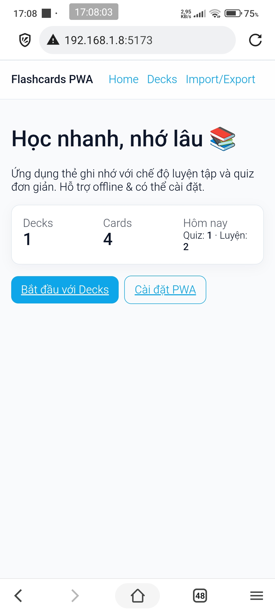
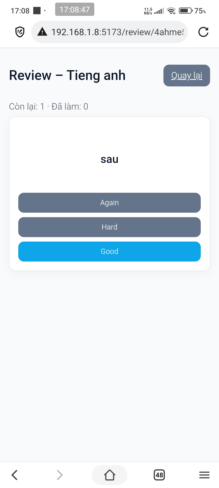
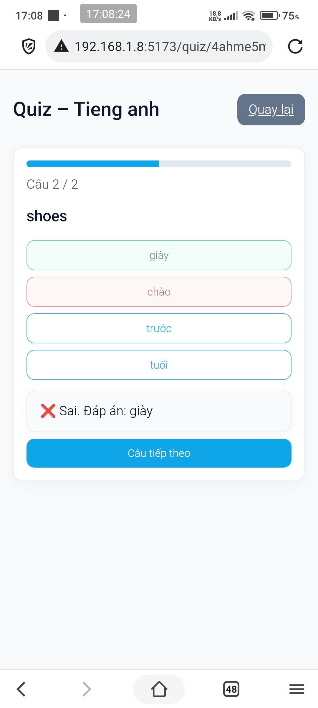

## Phát triển ứng dụng di động đa nền tảng 2526 (2)
- Sinh viên: Lê Cẩm Bình
- MSSV: 22IT.EB007
- Đề tài 6

# Flashcards PWA (React + Vite)
Ứng dụng học từ vựng qua **thẻ ghi nhớ** (flashcards) với **Review (Spaced Repetition)** và **Quiz trắc nghiệm**. Hỗ trợ **PWA**: cài như app, chạy **offline**, tự **cập nhật**.

## Tính năng
- **Decks & Cards**: tạo/sửa/xoá deck; thẻ gồm *front/back*, ví dụ, tags.
- **Review (SRS)**: Thuật toán giản lược kiểu SM-2/Leitner (file `src/logic/srs.ts`).
- **Quiz**: 4 lựa chọn, chấm **ngay lập tức**; kết quả cuối gồm điểm & thời gian.
- **Offline-first**: Cache asset + dữ liệu cục bộ (IndexedDB qua `localforage`).
- **Installable**: Manifest + Service Worker (Workbox) → Add to Home Screen.
- **Import/Export**: JSON cho decks/cards.

## Tech stack
- **React + Vite (TS)**
- **vite-plugin-pwa** + **Workbox** 
- **localforage** 
- **react-router-dom**

## Cấu trúc chính
```text
src/
├─ app/            # router, providers (PWA update toast)
├─ components/     # DeckList, CardEditor, ReviewPlayer, Quiz, Stats
├─ db/             # storage (localforage instances + helpers)
├─ logic/          # srs.ts (spaced repetition), quiz.ts (tạo MCQ)
├─ pages/          # Home, DecksPage, DeckDetailPage, ReviewPage, QuizPage, ImportExportPage
└─ styles/         # index.css (UI cơ bản + responsive)
```

## PWA chi tiết
- Manifest: khai báo trong vite.config.ts (icons, theme_color, display…).
- Icons: đặt tại public/icons/ với các kích thước 48 → 512px (có thể thêm maskable).
- Service Worker: do vite-plugin-pwa sinh; cấu hình runtime caching fonts & same-origin.
- Auto Update: registerType: 'autoUpdate' + src/app/providers.tsx hiển thị toast “Đã có phiên bản mới” → bấm Cập nhật để reload SW.

## Bắt đầu
- Yêu cầu: Node.js **>= 18**
- Cài & chạy dev
```bash
npm i
npm run dev
```
Vite in ra Local và Network URL (LAN), có thể mở trên điện thoại cùng Wi‑Fi.

## Photo
<p align="center">
  
  
  
  
  
  
  
  
</p>


# React + TypeScript + Vite

This template provides a minimal setup to get React working in Vite with HMR and some ESLint rules.

Currently, two official plugins are available:

- [@vitejs/plugin-react](https://github.com/vitejs/vite-plugin-react/blob/main/packages/plugin-react) uses [Babel](https://babeljs.io/) for Fast Refresh
- [@vitejs/plugin-react-swc](https://github.com/vitejs/vite-plugin-react/blob/main/packages/plugin-react-swc) uses [SWC](https://swc.rs/) for Fast Refresh

## Expanding the ESLint configuration

If you are developing a production application, we recommend updating the configuration to enable type-aware lint rules:

```js
export default defineConfig([
  globalIgnores(['dist']),
  {
    files: ['**/*.{ts,tsx}'],
    extends: [
      // Other configs...

      // Remove tseslint.configs.recommended and replace with this
      tseslint.configs.recommendedTypeChecked,
      // Alternatively, use this for stricter rules
      tseslint.configs.strictTypeChecked,
      // Optionally, add this for stylistic rules
      tseslint.configs.stylisticTypeChecked,

      // Other configs...
    ],
    languageOptions: {
      parserOptions: {
        project: ['./tsconfig.node.json', './tsconfig.app.json'],
        tsconfigRootDir: import.meta.dirname,
      },
      // other options...
    },
  },
])
```

You can also install [eslint-plugin-react-x](https://github.com/Rel1cx/eslint-react/tree/main/packages/plugins/eslint-plugin-react-x) and [eslint-plugin-react-dom](https://github.com/Rel1cx/eslint-react/tree/main/packages/plugins/eslint-plugin-react-dom) for React-specific lint rules:

```js
// eslint.config.js
import reactX from 'eslint-plugin-react-x'
import reactDom from 'eslint-plugin-react-dom'

export default defineConfig([
  globalIgnores(['dist']),
  {
    files: ['**/*.{ts,tsx}'],
    extends: [
      // Other configs...
      // Enable lint rules for React
      reactX.configs['recommended-typescript'],
      // Enable lint rules for React DOM
      reactDom.configs.recommended,
    ],
    languageOptions: {
      parserOptions: {
        project: ['./tsconfig.node.json', './tsconfig.app.json'],
        tsconfigRootDir: import.meta.dirname,
      },
      // other options...
    },
  },
])
```
